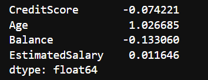
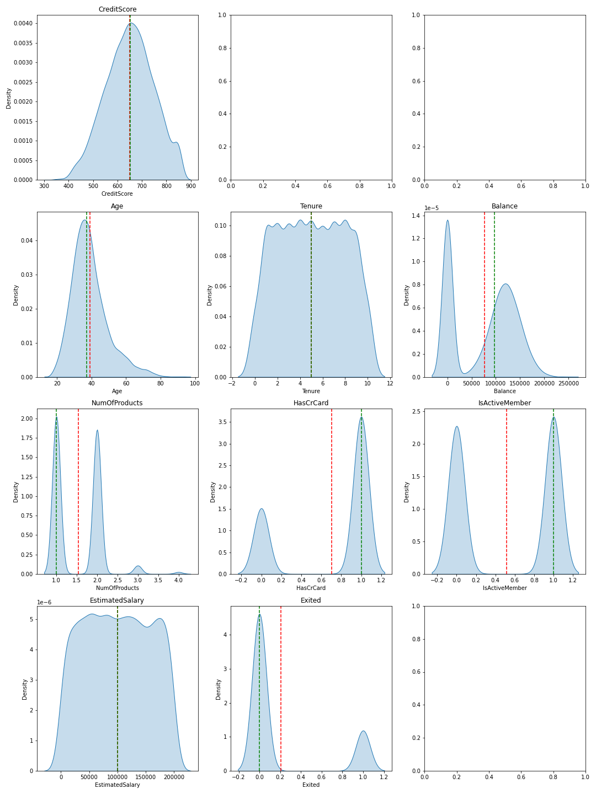

#  Churn Prediction for Bank Customers Using Machine Learning

## Business Problem

**Churn Prediction for Bank Customers Using Machine Learning** merupakan tindakan bagaimana mengidentifikasi pelanggan bank yang cenderung beralih ke bank lain sehingga bank dapat mengambil tindakan yang tepat untuk mempertahankan pelanggan. Dengan menggunakan Machine Learning, bank dapat mengambil pendekatan yang lebih proaktif dan mengurangi biaya akuisisi pelanggan baru dengan mempertahankan pelanggan yang sudah ada. Oleh karena itu, pengembangan model prediksi churn yang akurat dan andal mampu membantu bank dalam **mengurangi churn rate dan meningkatkan retensi pelanggan**.

## Business Objective

Objektif bisnis dari **Churn Prediction for Bank Customers Using Machine Learning** adalah untuk membantu bank mengidentifikasi pelanggan yang berpotensi meninggalkan layanan dan mengembangkan strategi retensi yang efektif, sehingga dapat mempertahankan pelanggan dan meningkatkan loyalitas pelanggan secara keseluruhan. Dengan memprediksi kemungkinan churn, bank dapat mengambil tindakan yang diperlukan untuk mempertahankan pelanggan yang bernilai dan meningkatkan kepuasan pelanggan.

## Business Metrics

**`Churn Rate`**  : mereduksi persentase jumlah pelanggan yang berhenti berlangganan layanan bank dalam periode tertentu.

## Machine Learning Solution

**Machine Learning Solution** Churn Prediction for Bank Customers Using Machine Learning adalah mengembangkan model prediksi churn menggunakan algoritma machine learning **LightGBM**, dengan melakukan preprocessing data dan feature engineering terlebih dahulu, kemudian melakukan tuning hyperparameter untuk mendapatkan model yang terbaik. Setelah itu, model tersebut dapat digunakan untuk memprediksi kemungkinan churn pada nasabah bank atau memprediksi kelas **0 untuk stay dan kelas 1 untuk churn**, sehingga bank dapat mengambil tindakan pencegahan yang tepat untuk mempertahankan nasabah dan meningkatkan retention rate. Selain itu, monitoring kinerja model dan perbaikan terus-menerus juga perlu dilakukan untuk memastikan model tetap akurat dan relevan dengan kondisi pasar yang selalu berubah.

## Machine Learning Metrics

**Churn Prediction for Bank Customers** merupakan perangkat analisa data untuk mengetahui nasabah yang churn berdasarkan profile nasabah bank yang telah tersedia.

Kumpulan data ini berisi rincian nasabah bank dan variabel target adalah variabel biner (stay and churn) yang mencerminkan fakta apakah nasabah meninggalkan bank (menutup rekeningnya) atau tetap menjadi nasabah suatu bank. variabel fitur akan diproses guna memprediksi apakah nasabah akan menutup rekening atau tidak

User menginginkan metrics bisnis berupa `recall` yakni lebih mengutamakan memprediksi churn namun sebenarnya tidak churn daripada memprediksi nasabah tidak churn sebenarnya nasabah tersebut churn, hal ini menunjukkan bahwa metode yang digunakan akan **memperkecil nilai True Negative (TN) dan False Negative (FN), dan menaikkan TP (TP) dan False Positive (FP)**.

Namun pada eksplorasi kali ini `Churn Prediction for Bank Customers` akan menampilkan beberapa metrics sebagai berikut:

 1. **Accuracy**: metrik yang paling umum digunakan untuk mengukur seberapa
    akurat model dalam memprediksi kelas target. Accuracy dihitung
    sebagai rasio antara jumlah prediksi benar dengan jumlah total
    prediksi.
 2. **Precision**: metrik yang mengukur seberapa banyak dari kelas yang
    diprediksi sebagai positif yang benar-benar positif. Precision
    dihitung sebagai rasio antara jumlah True Positives dengan jumlah
    True Positives dan False Positives.
 3. **Recall**: metrik yang mengukur seberapa banyak dari kelas positif yang
    benar-benar terdeteksi oleh model. Recall dihitung sebagai rasio
    antara jumlah True Positives dengan jumlah True Positives dan False
    Negatives.
 4. **F1 Score**: merupakan harmonic mean dari Precision dan Recall. F1
    score memberikan kesimbangan antara Precision dan Recall dan
    digunakan untuk membandingkan kinerja model dengan metrik gabungan.
 5. **ROC-AUC**: Kurva Karakteristik Operasi Penerima (ROC) dan area di
    bawah kurva (AUC) digunakan untuk mengevaluasi kinerja model dengan
    menghitung rasio True Positive Rate (TPR) dan False Positive Rate
    (FPR). ROC-AUC memberikan nilai keseluruhan kinerja model dan
    digunakan untuk membandingkan beberapa model yang berbeda.
    
## Literature Review
1. emalata Jain  mengusulkan dua teknik machine learning untuk memprediksi churn pelanggan seperti Logistic Regression dan Logit Boost. 
instance memiliki 20 atribut. Percobaan mengungkapkan bahwa tidak banyak perbedaan hasil dari kedua teknik tersebut. 
Logistic Regression memiliki akurasi sebesar 85,2384%, sedangkan Logit Boost memiliki akurasi 85,1785%. (Helmata jain, 2020)
2. Nurul Izzati Mohammad mengusulkan untuk mengidentifikasi faktor-faktor yang mempengaruhi
churn pelanggan dan mengembangkan model prediksi churn yang efektif serta
memberikan analisis terbaik dari hasil visualisasi data. Kumpulan data dari kaggle terbuka
situs data. Ada tiga pengklasifikasi pembelajaran mesin seperti Logistic Regression
, ANN dan Random Forest digunakan. Hasil percobaan dengan tinggi
akurasi 85%. Pengklasifikasi Logistic Regression menunjukkan hasil terbaik (Muhammad, Nurul & Ismail, S.A. & Kama, Mohd & Mohd Yusop, Othman & Azmi, Azri, 2019)
3. Praveen Lalwani et al  mengusulkan proses prediksi menggunakan yang paling populer
memprediksi model yaitu, Logistic Regression, Naïve Bayes, Support Vector
Machine, Random Forest, Decision Tree, dll. di set kereta dan juga di boosting.
Hasil percobaan menunjukkan bahwa pengklasifikasi AdaBoost dan XGBoost memberikan
akurasi maksimal 81,71% dan 80,80%.

## Alur Transformasi Data

### Data Preparation

**Gambar Arsitektur Data Preparation**

#### Dataset Definition
Data yang digunakan merupakan data yang menggambarkan profile nasabah yang menutup rekening dan nasabah yang tetap. adapun fitur profile nasabah yang digunakan antara lain.
Data disadur dari laman

[https://www.kaggle.com/datasets/shantanudhakadd/bank-customer-churn-prediction](https://www.kaggle.com/datasets/shantanudhakadd/bank-customer-churn-prediction)

Data berisi 10000 baris dan 11 kolom yaitu :

**CreditScore       :
    [int64]
    [350 - 850]
    Skor Kredit yang diukur oleh pihak bank sebagai penilaian terhadap nasabah untuk menggambarkan  risiko kredit seorang calon debitur**

**Geography         :
    [object]
    ['France', 'Spain', 'Germany']
    Negara asal nasabah**

**Gender            :
    [object]
    ['male','female']
    Jenis Kelamin nasabah**
    
**Age               :
    [int64]
    [18 - 92]
    Jenis Kelamin nasabah**

**Tenure            :
    [int64]
    [0 - 10]
    Jumlah tahun kepesertaan nasabah**

**Balance            :
    [float64]
    [0.0 - 250898.09]
    Saldo bank nasabah**

**NumOfProducts      :
    [int64]
    [1, 3, 2, 4]
    Jumlah produk bank yang digunakan nasabah**

**HasCrCard           :
    [int64]
    [0 - 1]
    apakah nasabah memegang kartu kredit dengan bank atau tidak**.

** IsActiveMember      :
  [int64]
  [0 - 1]
  apakah nasabah adalah anggota aktif di bank atau tidak. **

**EstimatedSalary     :
    [float64]
    [11.58 - 199992.48]
    Perkiraan gaji nasabah dalam Dolar**

**Exited              :
    [int64]
    [0,1]
    1 jika nasabah menutup rekening dengan bank dan 0 jika nasabah dipertahankan.**

### Exploratory Data Analysis (EDA)

** Gambar Arsitektur Exploratory Data Analysis (EDA) **

#### Check Skewed Data

**Gambar Check Skewed Data**

Rules :

-   jika kolom mendapati skewnya sebesar > +- 0.5, maka dari itu kolom tersebut akan diimputasi dengan median
-   jika kolom mendapati skewnya sebesar <= +- 0.5 kolom lainnya akan diimputasi dengan mean

Imputasi Median :

-   Age

Imputasi Mean :

-   CreditScore
-   Balance
-   EstimatedSalary

Imputasi untuk data kategorikal ialah menggunakan modus Imputasi untuk data numerikal ialah median dan mean tergantung skewed yang sudah dijelaskan diatas karena masing-masing memiliki kelas 0 dan 1 tidak terpaut jauh dan tidak menggunakan kelas.

#### Distribusi Data

Visualisasi menggunakan kdeplot diatas menghasilkan bentuk distribusi data masing-masing kolom dengan garis merah sebagai garis mean dari kolom data dan warna hijau sebagai garis median dari kolom data.

**Gambar Distribusi Data**

- CreditScore memiliki data dalam bentuk normal distribution

- Age memiliki data dalam bentuk right skewed distribution

- EstimatedSalary memilikii data dalam bentuk uniform distribution

- Balance memiliki data dalam bentuk bimodal distribution

#### Check Proporsi Data

**Gambar Proporsi Data**

Berdasarkan persentase label stay dan exited menyatakan ketidakseimbangan label, untuk user yang stay memiliki porsi `79.5%` sedangkan user Exited memiliki porsi `20.5%`

#### Check Korelasi Data

**Gambar Check Korelasi Data**

Jika dilihat dari hasil cek korelasi diatas antar variabel tidak memiliki korelasi yang positif kuat, dan yang memiliki korelasi positif tertinggi hanya memiliki poin 0.28 yakni antara Age dan Exited

#### Outlier Detection

**Gambar Outlier Detection**

Memang pada hasil ploting diatas memiliki titik titik outlier yang cukup banyak yang berada pada kolom CreditScore dan Age, namun setelah melakukan validasi ulang, user menyatakan bahwa data tersebut normal terjadi.

#### Kesimpulan Explolatory Data Analysis

1. Data yang tidak diperuntukan untuk pemodelan dan eda akan  langsung di drop pada data preparation yakni kolom "RowNumber","CustomerId","Surname".

2. Skewed pada data numerical menyatakan bahwa untuk kolom Age akan dilakukan imputasi dengan metode median dan untuk kolom CreditScore, Balance, EstimatedSalary menggunakan metode mean dan data kategorikal diputuskan untuk menggunakan modus untuk metode imputasinya dan tidak menggunakan kelas

3. Distribusi Data kategorikal, CreditScore memiliki data dalam bentuk normal distribution, Age memiliki data dalam bentuk right skewed distribution, EstimatedSalary memilikii data dalam bentuk uniform distribution, Balance memiliki data dalam bentuk bimodal distribution.

4. Data Imbalance, maka perlu dilakukan balancing data untuk menyeimbangkan label target.

5. Outlier Detection, memang terdapat titik yang menggambarkan oulier, namun data tersebut dirasa normal terjadi.

### Data Preprocessing
** Gambar Data Preprocessing **

Setelah mendapatkan mandat dari hasil eksplorasi data diatas maka dilakukan implementasi pada data preprocessing antara lain

* Handling Missing Value dengan kolom Age akan dilakukan imputasi dengan metode median dan untuk kolom CreditScore, Balance, EstimatedSalary menggunakan metode mean dan data kategorikal diputuskan untuk menggunakan modus untuk metode imputasinya dan tidak menggunakan kelas

* Get Dummies pada Kolom Geography dan Gender

** Gambar Get Dummies **

Setelah melakukan get dummies pada data terlihat kolom Gender dan Geography sudah berubah bentuk menjadi get_dummies

* Balancing Data dengan menggunakan metode Random Over Sampling

Setelah melakukan balancing data terlihat bahwa label pada kolom Exited menjadi seimbang yakni dengan proporsi 50% untuk kelas 0 dan 50% untuk kelas 1

* Dan melakukan scaling data pada kolom "CreditScore", "Age", "EstimatedSalary", "Balance"

**Gambar Data Scaling**

Dapat dilihat bahwa data sudah dilakukan scaling dengan menggunakan standarscaler

* Sorted Column untuk melakukan defense urutan column

**Gambar Sorted Columns**

* Data Clean, siap untuk dilanjutkan pada tahap pemodelan

### Data Modeling

**Gambar Arsitektur Data Modeling**

1. Setelah melakukan Data Preprocessing, hasilnya akan dilakukan pemodelan agar bisa memprediksi nasabah stay atau exited

2. Pemodelan Binary Classification akan menggunakan metode LightGBM

**LightGBM: Gradient Boosting for Binary Classification**

LightGBM (Light Gradient Boosting Machine) adalah salah satu algoritma machine learning yang kuat untuk binary classification. Algoritma ini memanfaatkan teknik Gradient Boosting Decision Trees (GBDT) yang merupakan metode ensemble learning. Seperti halnya XGBoost, LightGBM juga membangun beberapa decision tree secara sekuensial, dengan setiap tree bertujuan untuk meningkatkan hasil prediksi dari tree sebelumnya. Hasil prediksi dari model ini digunakan untuk tugas-tugas seperti binary classification, regression, dan ranking.

Pada dasarnya, LightGBM bekerja dengan cara berikut:

* Pembangunan Decision Tree: LightGBM membangun sejumlah decision tree secara sekuensial. Setiap tree bertujuan untuk mengoreksi prediksi dari tree sebelumnya.
* Loss Function: Untuk mengukur sejauh mana hasil prediksi dari model mendekati nilai aktual, LightGBM menggunakan loss function. Dalam binary classification, log loss function sering digunakan.
* Optimisasi Objective Function: Selama proses training, LightGBM melakukan optimisasi terhadap objective function. Objective function ini mencoba meminimalkan kesalahan antara prediksi dan nilai aktual dengan menambahkan sejumlah decision tree.

Rumus matematis untuk objective function dalam binary classification dengan LightGBM adalah sebagai berikut

Selama proses training, LightGBM melakukan optimisasi objective function menggunakan teknik gradient descent. Setiap decision tree yang ditambahkan pada model membantu memperbaiki prediksi dari tree sebelumnya dengan menambahkan residual error dari iterasi sebelumnya pada setiap label target. Pada akhir iterasi, LightGBM menghasilkan prediksi final berupa probabilitas untuk masing-masing label pada data testing.

LightGBM sering dianggap efisien dalam pelatihan model karena penggunaan histogram-based learning dan teknik-teknik lain yang mengurangi kompleksitas perhitungan, sehingga memungkinkan pelatihan model yang lebih cepat.

Hasil pemodelan dengan menggunakan LightGBM ialah sebagai berikut dan skor Recall yang dihasilkan pada data valid dan test dirasa cukup baik.

dan berikut hasil dari classification report dari pemodelan diatas

Classification Report untuk Data Test

Classification Report untuk Data Valid

Data Valid dan Data Test Recall Score

Berdasarkan hasil Classification report diatas Recall pada classification report merupakan salah satu metrik evaluasi klasifikasi yang mengukur seberapa baik model dalam mengidentifikasi kelas positif atau kelas minoritas. Pada laporan di atas, recall untuk kelas 0 adalah 0.86 dan recall untuk kelas 1 adalah 0.75. Ini berarti model memiliki kinerja yang lebih baik dalam mengidentifikasi kelas mayoritas (0) daripada kelas minoritas (1). Dalam konteks bisnis, ini dapat berarti bahwa model kurang sensitif dalam mengidentifikasi kasus kelas minoritas, sehingga dapat mengabaikan pelanggan yang berpotensi keluar dari bisnis. Oleh karena itu, dalam kasus ini, perlu diperhatikan meningkatkan recall untuk kelas minoritas agar model dapat mengidentifikasi pelanggan yang berpotensi keluar lebih baik.

dan berikut hasil ROC dan AUC model XGboost yang digunakan untuk pemodelan kali ini

AUC (Area Under the Curve) adalah metrik evaluasi yang digunakan untuk mengukur kinerja model klasifikasi biner. Nilai AUC menunjukkan seberapa baik model dapat membedakan antara kelas positif dan negatif.

AUC memiliki rentang nilai antara 0 hingga 1, dimana semakin tinggi nilai AUC, semakin baik kinerja model dalam membedakan antara kelas positif dan negatif. Dalam kasus ini, nilai AUC sebesar 0.873 menunjukkan bahwa model memiliki kinerja yang baik dalam membedakan antara kelas positif dan negatif.

## Machine Learning Services

** Arsitektur Machine Learning Services **

Selanjutnya, setelah melalui beberapa proses dan model telah di save akan dilanjutkan pada deployment dengan menggunakan API dan Streamlit gambar dibawah ini merupakan contoh mengakses menggunakan ML Services melalui FAST API Swagger UI

Berikut contoh input data yang digunakan untuk mengakses API

Berikut hasil output prediksi dari API services

Agar lebih ramah dalam menggunakannya dan tampilannya lebih powerfull, user disuguhkan dengan apps sederhana yang dibangun dengan menggunakan streamlit services, berikut contoh penggunaannya

User diharapkan mengisi form yang sudah disediakan hingga selesai, jika terdapat kesalahan range dalam input data streamlit akan menampilkan error dibagian mana yang inputnya salah, jika dirasa sudah sesuai kriteria maka klik tombol `predict` dan akan mengelarkan hasil `Prediction Result: Class 0 = Customer stay` dan `Class 1 = Customer churn`

## Menggunakan Docker Container
Ketika service ingin dijalankan bersamaan, maka kita perlu menggunakan tools yang mendukung hal tersebut, salah satunya dapat menggunakan docker berikut contoh service sederhana yang dijalankan dengan bantuan docker

Berikut hasil input service ke docker container

Berikut hasil input service ke docker Image

## Kesimpulan

1. Model machine learning dengan menggunakan LightGBM cukup memberikan hasil yang mengesankan dalam pemodelan dibuktikan dengan nilai Validation recall: 0.833 Test recall: 0.839 dan recall untuk kelas 0 adalah 0.86 dan recall untuk kelas 1 adalah 0.75. Ini berarti model memiliki kinerja yang lebih baik dalam mengidentifikasi kelas mayoritas (0) daripada kelas minoritas (1) dan Dalam kasus ini, nilai AUC sebesar 0.873 menunjukkan bahwa model memiliki kinerja yang baik dalam membedakan antara kelas positif dan negatif hal ini sesuai dengan machine learning metrics yang sudah didefinisikan
2. For Future Works, lebih banyak variabel yang dilakukan pemodelan untuk memodelkan seseorang yang churn dan stay, dan lebih banyak percobaan atau riset terkait cara meningkatkan nilai recall yang jauh lebih tinggi

## Referensi

- Mahalekshmi, A., & Chellam, G. H. (2022). Analysis of customer churn prediction using machine learning and deep learning algorithms. International Journal of Health Sciences, 6(S1), 11684²11693. 
- Jain H, (2021) Machine Learning Models Developed For Telecom Churn Prediction J Comput Eng Inf Technol 10:2 DOI: 10.37532/jceit.2021.10(2).251.
- Muhammad, Nurul & Ismail, S.A. & Kama, Mohd & Mohd Yusop, Othman & Azmi, Azri. (2019). Customer Churn Prediction In Telecommunication Industry Using Machine Learning Classifiers. 1-7. 10.1145/3387168.3387219. 
- Lalwani, P., Mishra, M.K., Chadha, J.S. et al. Customer churn prediction system: a machine learning approach. Computing 104, 271–294 (2022). https://doi.org/10.1007/s00607-021-00908-y
- https://medium.com/geekculture/lightgbm-for-binary-classification-in-python-910aa0b4e557
- Materi Pacmann
- https://towardsdatascience.com/step-by-step-approach-to-build-your-machine-learning-api-using-fast-api-21bd32f2bbdb
- https://engineering.rappi.com/using-fastapi-to-deploy-machine-learning-models-cd5ed7219ea
- https://nitin9809.medium.com/lightgbm-binary-classification-multi-class-classification-regression-using-python-4f22032b36a2